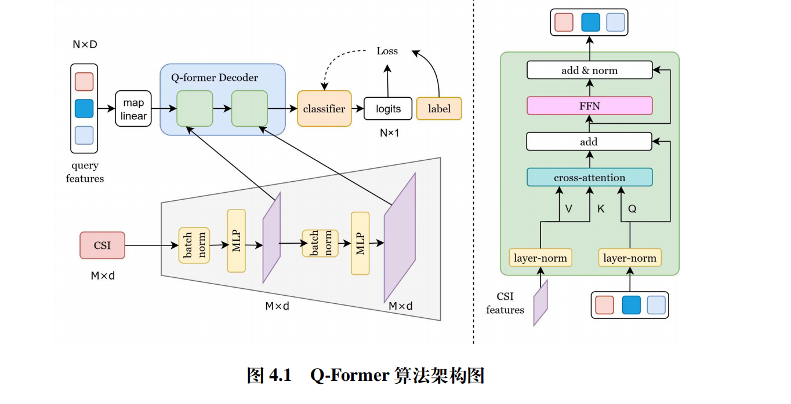

针对问题二，基于数据集中用于监督的信号十分单一的情况， 我们将速率预估问题建模成速率标签分类问题，并从序数分类的角度来对齐分类任务和速率估计任务的差别，从而做出稳健的预测。具体来说提出了一种基于交叉注意力Crossattention的离散速率预测方法Q-formerF。我们仿照Sin_reef的思路，创新性的引入Q-former模块, 通过交叉注意力来建模各个子载波的信道交互特征并压缩成一个等效特征向量query_eff，从而有效地减少了模型参数。同时我们设计了级联式多层感知机（MLP）结构以实现多尺度特征的提取，从而有效增强了信道表征的表达能力。最后我们将Q-former得到的query 输出经过一个简单的线性层映射为 logits，并引入高斯标签平滑（Gaussian Label Smoothing, GLS）损失函数来解决传统交叉熵损失函数在处理序数型标签时仅考虑准确类别、忽略类别之间内在顺序关系的问题。在推理阶段，取 logits 最大值对应的类别，并映射为实际速率。相比传统连续回归与等效 SINR 方法，该方法直接进行离散分类预测，从速率的概率分布角度而不是期望回归角度建立估计模型，从而在监督信号单一的情况下提高预测精度与鲁棒性。
针对问题三，在问题二提出的基于 Q-Former 的离散速率预测框架基础上，在特征构建阶段引入奇异值分解（SVD），对每个子载波的信道矩阵进行 SVD 分解，并将信道矩阵元素与对应的奇异值加权相乘，再取模后除以噪声功率，形成增强特征，从而突出信道的主导子空间信息。随后，利用级联MLP提取子载波的多尺度特征，并用 Q-Former 模块捕捉不同子载波及空间维度之间的深层交互关系，得到一个等效特征向量query_eff。最后，将该表示通过线性分类器映射为离散速率类别，并在训练阶段采用高斯标签平滑（GLS）损失进行优化，以增强模型在监督信号单一情况下对速率预估的准确性和鲁棒性，提高泛化性能。
